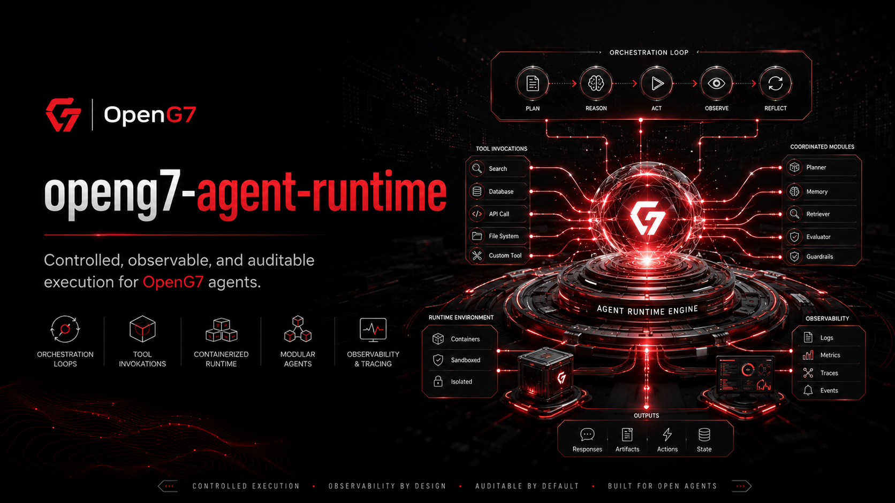

# OpenG7 Agent Runtime

Controlled, observable and auditable execution environment for OpenG7 AI agents.

> **Implementation status:** specification and governance only. Application workspaces,
> package manifests, Docker launch files and production checklists described below
> are planned, not present. Currently available validation:
> `node scripts/check-project-standards.mjs`. Read [AGENTS.md](AGENTS.md)
> and the [project architecture](docs/ARCHITECTURE.md) for the applicable scope.

## Workspace architecture

Target workspace architecture:

- `apps/runtime-api`: agent session, task, approval and execution API.
- `apps/runtime-worker`: durable agent orchestration and recovery worker.
- `packages/agent-domain`: tasks, plans, steps, tool calls, artifacts and execution state.
- `packages/agent-orchestrator`: plan-act-observe-reflect execution loop.
- `packages/agent-tools`: structured, allowlisted tool contracts.
- `packages/agent-sandbox`: isolated process and container execution adapters.
- `packages/agent-memory`: bounded session and task memory interfaces.
- `packages/agent-observability`: logs, traces, metrics and replay events.
- `packages/agent-sdk`: typed agent and tool development SDK.

## Controlled execution approach

Agents must operate through structured tools and explicit state transitions.

Recommended task lifecycle:

```text
queued
→ planning
→ awaiting_policy
→ executing
→ awaiting_approval
→ verifying
→ completed | failed | cancelled
```

Do **not** give an agent unrestricted production shell access or direct long-lived credentials.

## Tool guidance

Every tool must define:

- typed input and output schema
- required permissions
- allowed environments
- timeout and resource limits
- idempotency behavior
- audit classification
- rollback or compensation behavior
- sensitive-field redaction rules

Prefer narrow operations such as `git.create_branch` or `database.run_migration` over a generic unrestricted shell command.

## Sandbox guidance

Use disposable, isolated environments for code execution:

- read-only base image
- ephemeral writable workspace
- network disabled by default
- allowlisted outbound destinations
- CPU, memory, process and disk limits
- no host Docker socket
- short-lived credentials
- artifact capture before destruction

Production actions should be executed by controlled deployment tools, not from the development sandbox.

## Reuse in other projects

OpenG7 projects can build compatible agents and tools with:

- `@openg7/agent-domain`
- `@openg7/agent-sdk`
- `@openg7/agent-tools`
- `@openg7/agent-observability`

The runtime must remain model-neutral and communicate with models through `openg7-model-gateway`.

## OpenG7 example configuration

Initial code-agent profile:

- Agent: `openg7-mini-code-agent`
- Model route: `north-mini-code/default`
- Allowed repository: one explicitly selected OpenG7 repository
- Network: disabled except approved package registries in setup phases
- Production access: denied
- Pull request creation: approval required
- Commands: lint, test, build and repository-scoped scripts
- Maximum execution duration: bounded per task

## Commands

The initial workspace is expected to expose the following commands:

```bash
corepack enable
yarn install
yarn lint
yarn format
yarn format:check
yarn test
yarn build
yarn docs
```

Commands may evolve with the implementation, but CI should preserve equivalent lint, test, build, and documentation gates.

## Production launch

Use `docs/production-launch-checklist.md` before enabling persistent workers.

The first production scope should support analysis and pull-request preparation only. Direct production deployment, financial operations and destructive infrastructure changes remain out of scope for V1.

## Agent Runtime module (V1)

### Environment variables

- `AGENT_RUNTIME_ENV` — `development`, `test`, or `production`.
- `AGENT_RUNTIME_ALLOWED_ORIGINS` — allowed administrative UI origins.
- `AGENT_RUNTIME_DATABASE_URL` — private PostgreSQL connection string.
- `AGENT_RUNTIME_QUEUE_DRIVER` — durable queue provider identifier.
- `AGENT_RUNTIME_MODEL_GATEWAY_URL` — required model gateway endpoint.
- `AGENT_RUNTIME_POLICY_ENGINE_URL` — required production policy decision endpoint.
- `AGENT_RUNTIME_KNOWLEDGE_CORE_URL` — optional context retrieval endpoint.
- `AGENT_RUNTIME_IDENTITY_ISSUER` — trusted OpenG7 Identity issuer.
- `AGENT_RUNTIME_AUDIT_ENDPOINT` — required production audit sink.
- `AGENT_RUNTIME_SANDBOX_DRIVER` — `docker`, `kubernetes`, or another approved adapter.
- `AGENT_RUNTIME_MAX_TASK_SECONDS` — hard task timeout.
- `AGENT_RUNTIME_MAX_TOOL_CALLS` — maximum tool calls per task.
- `AGENT_RUNTIME_MAX_PARALLEL_TASKS` — worker concurrency limit.
- `AGENT_RUNTIME_DEFAULT_NETWORK_MODE` — should default to `none`.
- `AGENT_RUNTIME_ARTIFACT_STORAGE_DRIVER` — private artifact storage provider.
- `AGENT_RUNTIME_ENCRYPTION_KEY` — application-level encryption secret for protected task state.

Example values belong in `.env.example`.

### Local launch

```bash
docker compose --profile database up -d postgres
corepack yarn dev
```

Run one local task fixture:

```bash
corepack yarn agent:run --fixture fixtures/repository-analysis.json
```

### Private PostgreSQL

Recommended initial tables:

- `agent_definitions`
- `agent_tasks`
- `agent_task_steps`
- `agent_tool_calls`
- `agent_approvals`
- `agent_artifacts`
- `agent_execution_events`
- `agent_runtime_leases`

Persist normalized state and audit references. Avoid storing unredacted secrets or unnecessary full prompt histories.

### Agent API

```text
POST /api/agents
GET  /api/agents
GET  /api/agents/:agentId
POST /api/agent-tasks
GET  /api/agent-tasks
GET  /api/agent-tasks/:taskId
POST /api/agent-tasks/:taskId/cancel
POST /api/agent-tasks/:taskId/retry
GET  /api/agent-tasks/:taskId/events
GET  /api/agent-tasks/:taskId/artifacts
```

### Approval API

```text
GET  /api/agent-approvals
POST /api/agent-approvals/:approvalId/approve
POST /api/agent-approvals/:approvalId/reject
```

An approval screen should display:

- requested action
- affected resource and environment
- agent and model version
- policy decision and reason
- exact tool input
- expected side effects
- rollback or compensation plan
- supporting evidence and verification state

### Tool invocation contract

Example structured tool request:

```json
{
  "tool": "git.create_branch",
  "version": "1",
  "input": {
    "repository": "openg7-funding-platform",
    "base": "main",
    "branch": "agent/stripe-fee-backfill"
  }
}
```

Tool implementations should return machine-verifiable status, artifacts and audit metadata.

### Agent loop

The orchestrator may use this controlled loop:

```text
plan
→ retrieve approved context
→ request policy decision
→ invoke one tool
→ observe structured result
→ update bounded state
→ verify progress
→ continue, request approval, or stop
```

A model must not claim completion until required verification tools return successful results.

### Code-agent profile

The initial Mini Code profile may expose:

```text
/analyze   analyze without modifying files
/fix       prepare a patch in a disposable branch
/test      add or improve tests
/docs      update repository documentation
/upgrade   prepare a dependency upgrade proposal
```

All write operations should target an isolated workspace and produce a patch or branch artifact for review.

### Recovery and idempotency

Workers must support:

- durable step checkpoints
- lease expiration and task recovery
- idempotent tool calls where possible
- duplicate-event rejection
- cancellation propagation
- bounded retries with classified errors
- manual intervention for uncertain side effects

Never automatically retry an irreversible action without an idempotency key and verified previous state.

### Observability

Collect:

- task completion and failure rates
- tool success and denial rates
- approval wait time
- model latency and token use
- sandbox startup time
- verification success
- policy decisions
- resource consumption

Use trace identifiers across the runtime, policy engine, model gateway and knowledge core.

## Security principles

- no unrestricted production shell
- no persistent plaintext credentials
- least-privilege tool tokens
- network denied by default
- isolated disposable workspaces
- mandatory policy checks
- explicit human approval for critical actions
- artifact and patch verification
- complete execution trace
- emergency task cancellation

## Integration with OpenG7

- `openg7-identity` — authenticates agents, users and approvers.
- `openg7-ai-policy-engine` — authorizes every protected tool action.
- `openg7-knowledge-core` — supplies provenance-preserving context.
- `openg7-model-gateway` — routes model inference requests.
- `openg7-ai-evals` — evaluates task completion, safety and tool use.
- `openg7-mini-code-lab` — supplies trained Mini Code variants and profiles.

## Initial roadmap

### V1

- durable agent tasks
- structured tool registry
- Docker sandbox
- model gateway integration
- policy preflight checks
- approval workflow
- patch and artifact output

### V2

- multi-agent task decomposition
- Kubernetes sandbox adapter
- task replay interface
- cost and resource budgets
- signed artifacts

### V3

- federated runtimes
- cross-organization delegation
- confidential computing adapters
- formally constrained critical workflows

## License and governance

The runtime should remain open and model-neutral. Tool implementations that connect to private infrastructure may be distributed separately, but their public contracts, permission requirements and audit behavior should remain documented.
